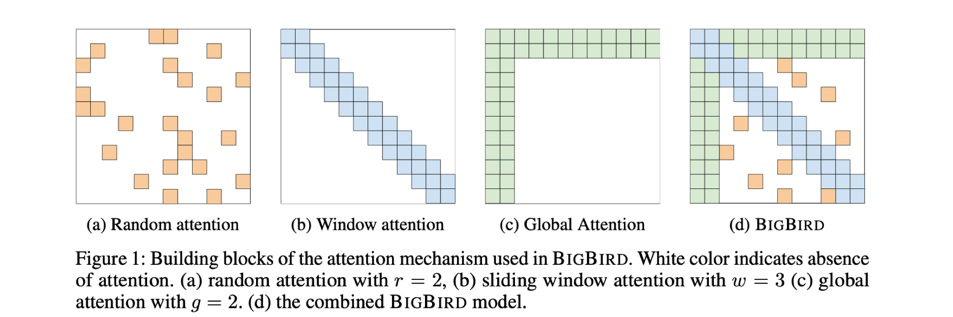
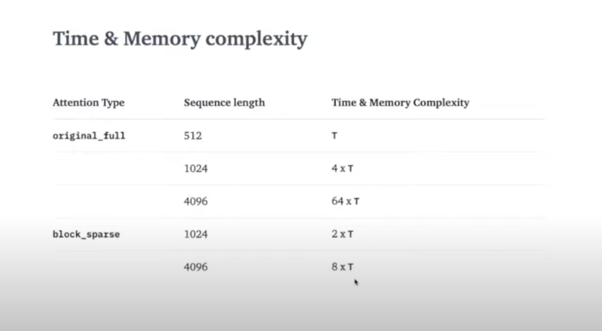

# FeedBackPrize is actually a kaggle competition and below is the approach i followed in the competition 

Before we started into approach lets talk a bit about BigBird Transformers 

We already knew that Bert Model cont handle longer sequences which are greater than 512 length (here is tokens size ) and there are some other model which handle like long-former etc.,But let's discuss about the Big Bird Transformer

In Bert we know the "each token" attend all its neighbourhood which is its try to re-represent itself in self-attention which is o(n**2)

what if the same is applied to a longer sequence , consider 4000+ tokens it will take forever to compute & it would require a lot of computing power 
 
To solve the above lets Big Bird Transformer do the follows the below trick 

1) Global Attention 
2) Random Attention 
3) Window Attention

Below is the image of Attention Matrix of BigBird Transformer . if you see below matrix of Big Bird Attention score is only calculated for highlighted one.

Because of the above attention Matrix the time complexity is decreased to  O(n)-inner products

Time & Memory Complexity 

Global Attention Matrix for Big Birds are of two types 

1) ITC 
2) ETC 

Different was if see the above Image which says Global Attention where only one token the start token is attending all instead of one token they increased it to 3 tokens 
thats only the difference.

Above is very cool isn't ?

BigBird comes with 2 implementations: original_full & block_sparse. For the sequence length < 1024, using original_full is advised as there is no benefit in using block_sparse attention.

1) If Sequence length  < 1024 ( Go with original_full)
2) If Sequence length > 1024 ( Go with block_sparse)

Let's see a code example below :

model = BigBirdModel.from_pretrained("google/bigbird-roberta-base")
# This will init the model with default configuration i.e. attention_type = "block_sparse" num_random_blocks = 3, block_size = 64.
model = BigBirdModel.from_pretrained("google/bigbird-roberta-base", num_random_blocks=2, block_size=16) # here block size is the query block size & num_random_block is 3 that means random tokens in each layer 

# By setting attention_type to `original_full`, BigBird will be relying on the full attention of n^2 complexity. This way BigBird is 99.9 % similar to BERT.
model = BigBirdModel.from_pretrained("google/bigbird-roberta-base", attention_type="original_full")

That's pretty much about Big Bird it can handle only sequence <=4096 token

Approach for FeedBackPrize Dataset :

I gone give the credit to Nicholas was inspired by his kernel

The dataset contains essay_id,  disclouser_text , discourse_type, discourse_effectiveness is the class label to predict 

With this new approach we created [CLS_discourse_type] & [END_discourse_type] for each disclouser_text and use the [CLS_disclouser] to find the class for each  disclouser_text.

We create the output label in such a way where we assign the Label value as "0,1,2," depends on the class type to each cls token only and we back prop only that loss.

Above is the overview of the approach to get detail overview please check out my notebook .

